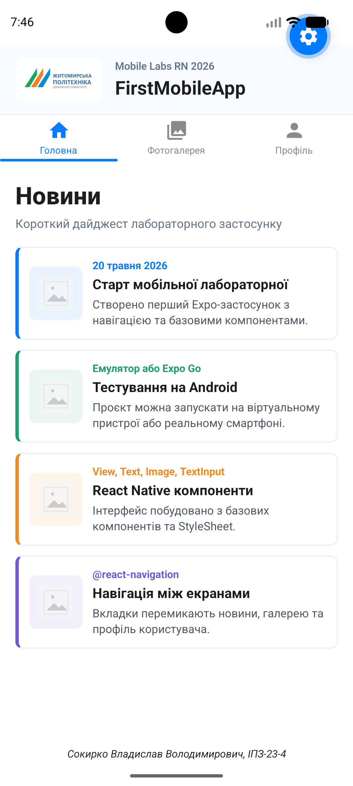
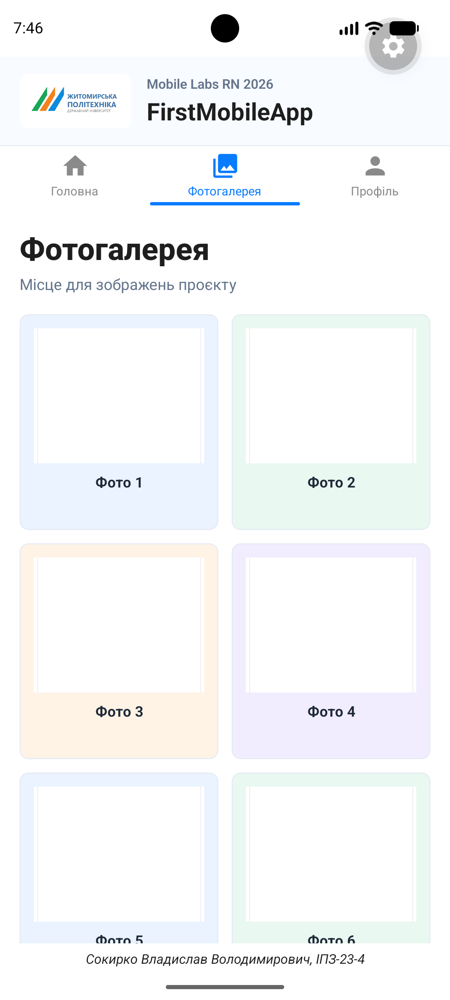
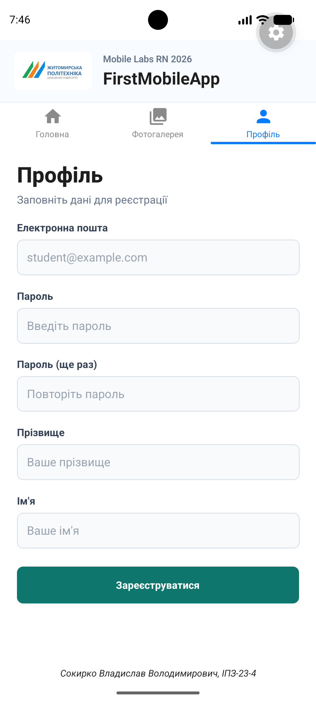

# Лабораторна робота №1

Тема: використання Expo для створення найпростішого додатку React Native та знайомство з базовими компонентами.

Застосунок `FirstMobileApp` містить три екрани з навігацією через `@react-navigation/material-top-tabs`:

- `Головна` - авторський дайджест новин із датою, коротким описом та візуальним маркером.
- `Фотогалерея` - адаптована сітка карток для фото з підписами.
- `Профіль` - форма реєстрації користувача з полями введення.

Інтерфейс не копіює приклади з методички один в один: структура лабораторної збережена, але оформлення виконано у власному стилі.

## Скріншоти

| Головна | Фотогалерея | Профіль |
| --- | --- | --- |
|  |  |  |

## Запуск проєкту

Перед запуском потрібні Node.js, npm, Expo CLI через `npx`, Android Studio з емулятором або телефон з Expo Go.

```bash
npm install
npx expo install --fix
npm run start
```

Після старту Metro Bundler можна:

- натиснути `a`, щоб відкрити додаток в Android-емуляторі;
- відсканувати QR-код телефоном у Expo Go;
- запустити через тунель для фізичного пристрою:

```bash
npm run tunnel
```

## Основні способи запуску

`Expo Go` підходить для швидкого тестування на реальному телефоні без збирання APK. Телефон і комп'ютер мають бути в одній мережі, а якщо мережа блокує підключення, зручно використати `--tunnel`.

`Android-емулятор` з Android Studio дозволяє тестувати застосунок без фізичного пристрою, перевіряти різні розміри екранів, версії Android та поведінку інтерфейсу під час розробки.

`Web` запуск через `npm run web` корисний для швидкого перегляду верстки в браузері, але він не повністю замінює тестування нативної поведінки на Android або iOS.

`Development build` потрібен, якщо в проєкті з'являться нативні модулі, яких немає в Expo Go. Для цієї лабораторної достатньо Expo Go або Android-емулятора.

## Структура

```text
lab1/
  App.js
  app.json
  babel.config.js
  package.json
  assets/
    logo.png
    news-placeholder.png
    gallery-placeholder.png
    screenshots/
```
