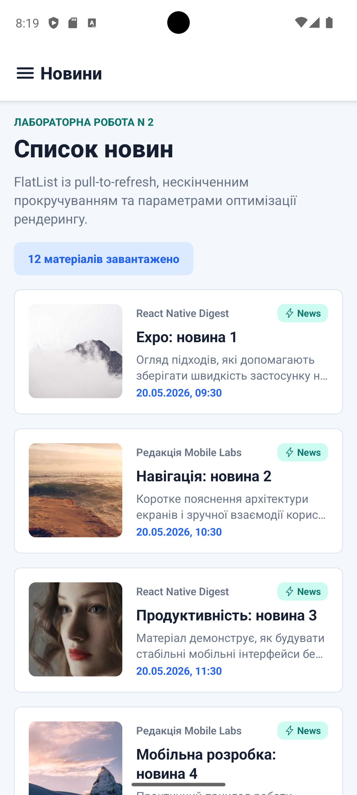
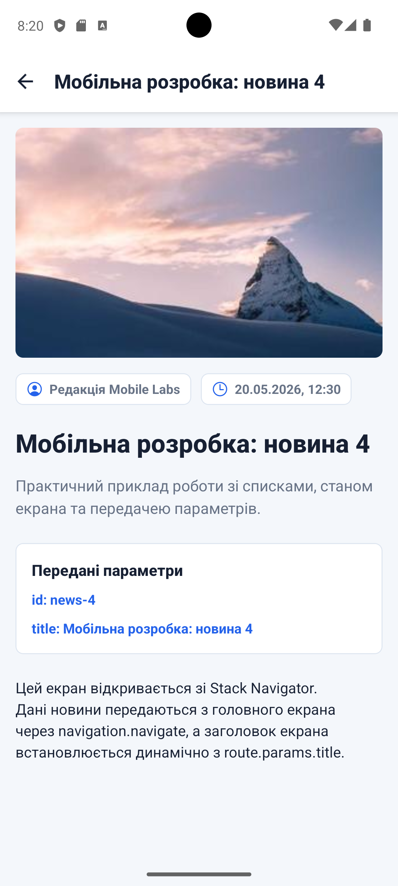
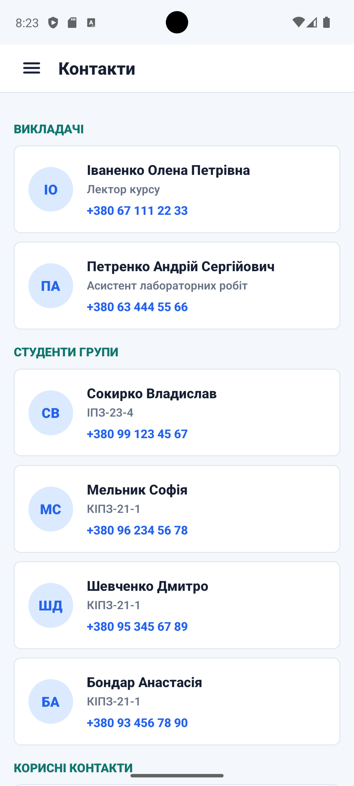

# Лабораторна робота N 2

**Тема:** побудова вкладеної навігації та оптимізація відображення великих списків у React Native із використанням `FlatList` та `SectionList`.

## Запуск

1. Встановити залежності:

```bash
npm install
```

2. Запустити Expo:

```bash
npm start
```

3. Відкрити застосунок в Expo Go або запустити на емуляторі:

```bash
npm run android
```

## Реалізований функціонал

- Створено вкладену навігацію: `Drawer Navigator` містить `Stack Navigator` для екранів новин.
- Реалізовано екрани `MainScreen`, `DetailsScreen` та `ContactsScreen`.
- На головному екрані використано `FlatList` для списку новин.
- Додано `Pull-to-Refresh` через `refreshing` та `onRefresh` з імітацією мережевого запиту через `setTimeout`.
- Додано `Infinite Scroll` через `onEndReached` та `onEndReachedThreshold`.
- Використано `ListHeaderComponent`, `ListFooterComponent` та `ItemSeparatorComponent`.
- Для оптимізації `FlatList` задано `initialNumToRender`, `maxToRenderPerBatch`, `windowSize` та `removeClippedSubviews`.
- Реалізовано перехід на екран деталей із передачею параметрів новини.
- Заголовок екрана деталей встановлюється динамічно через `route.params.title`.
- Подвійний header усунуто через `headerShown: false` у `Drawer Navigator` для вкладеного stack.
- На екрані контактів використано `SectionList` із секціями, `renderItem`, `renderSectionHeader`, `keyExtractor` та `ItemSeparatorComponent`.
- Створено кастомний `drawerContent` з аватаром, ПІБ, групою та пунктами меню "Новини" і "Контакти".

## Структура проєкту

```text
App.js
src/
  components/
    CustomDrawerContent.js
    NewsCard.js
  data/
    contacts.js
    news.js
  screens/
    ContactsScreen.js
    DetailsScreen.js
    MainScreen.js
  theme.js
```

## Скріншоти

### Список новин



### Деталі новини



### Контакти



### Картка


## Контрольні запитання та висновки

**1. Чим відрізняється FlatList від ScrollView?**  
`ScrollView` рендерить усі елементи одразу, тому при великих наборах даних швидко збільшує навантаження на пам'ять. `FlatList` рендерить лише видимі елементи та невелике вікно навколо них, тому краще підходить для великих списків.

**2. Що таке віртуалізація списків?**  
Віртуалізація списків - це підхід, за якого на екрані створюються тільки ті елементи, які користувач бачить зараз або побачить найближчим часом. Невидимі елементи не тримаються в дереві компонентів, що покращує продуктивність.

**3. Як здійснюється передача параметрів між екранами?**  
Параметри передаються другим аргументом у `navigation.navigate`. Наприклад, головний екран відкриває деталі так: `navigation.navigate('DetailsScreen', { title, description, image })`. На екрані деталей ці дані доступні через `route.params`.

**4. Що таке вкладена навігація?**  
Вкладена навігація - це структура, у якій один навігатор містить інший. У цій роботі `Drawer Navigator` містить `Stack Navigator`, а stack керує переходом від списку новин до деталей.

**5. У яких випадках застосовується SectionList?**  
`SectionList` застосовується, коли дані потрібно показати групами або секціями, наприклад контакти за категоріями, товари за типами чи повідомлення за датами.

**Висновок:** у роботі реалізовано вкладену навігацію, передачу параметрів між екранами, кастомне drawer-меню, оптимізований список новин через `FlatList` та згрупований список контактів через `SectionList`. Практично закріплено принципи віртуалізації списків і побудови мобільної навігації в React Native.
