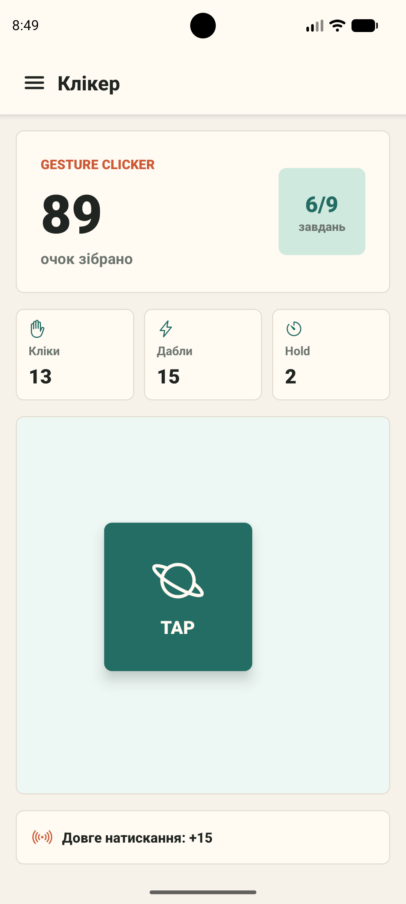
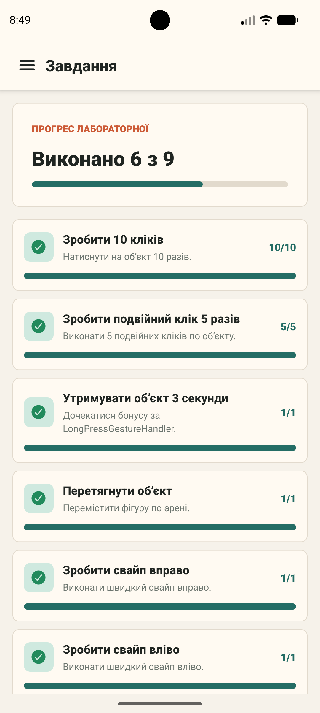
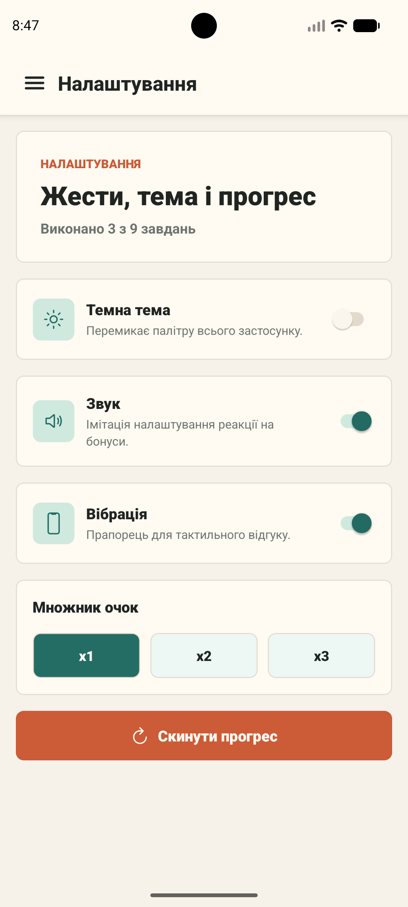

# Лабораторна робота №3

**Тема:** використання кастомних жестів у React Native та стилізація інтерфейсу мобільного застосунку.

Проєкт реалізує мобільну гру-клікер `Gesture Clicker`, де очки нараховуються за різні взаємодії з об’єктом: короткий tap, подвійний tap, довге утримання, перетягування, свайпи та масштабування.

## Запуск

1. Встановити залежності:

```bash
npm install
```

2. Запустити Expo:

```bash
npm start
```

3. Відкрити застосунок в Expo Go або запустити на емуляторі:

```bash
npm run android
```

## Реалізований функціонал

- Головний екран з лічильником очок, статистикою жестів і інтерактивним об’єктом.
- `TapGestureHandler` для короткого натискання: додає 1 очко.
- `TapGestureHandler` з `numberOfTaps={2}` для подвійного кліку: додає 2 очки.
- `LongPressGestureHandler` з утриманням 3 секунди: додає бонусні 15 очок.
- `PanGestureHandler` для перетягування об’єкта по арені.
- `FlingGestureHandler` для свайпу вправо та вліво: додає випадковий бонус від 5 до 20 очок.
- `PinchGestureHandler` для масштабування об’єкта: додає 8 бонусних очок.
- Сторінка завдань показує прогрес і статус виконання кожної умови лабораторної.
- Додано власне завдання: отримати великий випадковий бонус від 15 очок за свайп.
- Сторінка налаштувань містить світлу/темну тему, перемикачі звуку й вібрації, множник очок та скидання прогресу.
- Навігація між екранами реалізована через `@react-navigation/native` і `Drawer Navigator`.

## Структура проєкту

```text
App.js
index.js
src/
  components/
    ProgressBar.js
    StatPill.js
    TaskItem.js
  screens/
    GameScreen.js
    SettingsScreen.js
    TasksScreen.js
  state/
    GameContext.js
  theme.js
```

## Скріншоти

### Головний екран



### Сторінка завдань



### Сторінка налаштувань



## Висновки

У лабораторній роботі було створено React Native застосунок з кількома типами жестів із `react-native-gesture-handler`. Реалізовано нарахування очок, синхронізацію прогресу між екранами, сторінку завдань, сторінку налаштувань і підтримку світлої та темної теми. Робота показує, як жести можуть бути використані не лише для навігації, а й як основна механіка мобільної гри.
