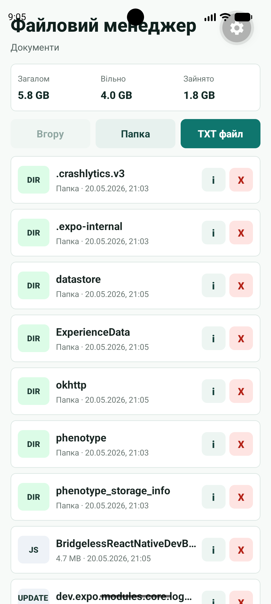
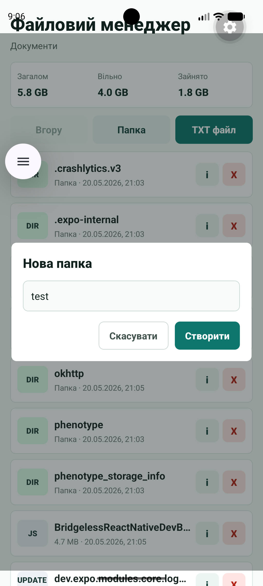
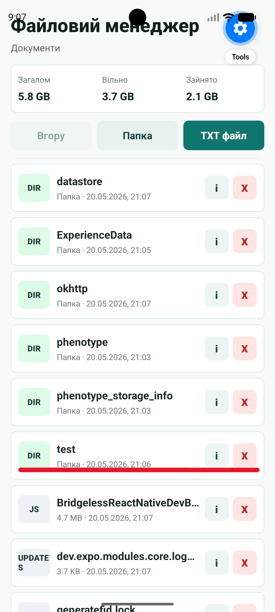
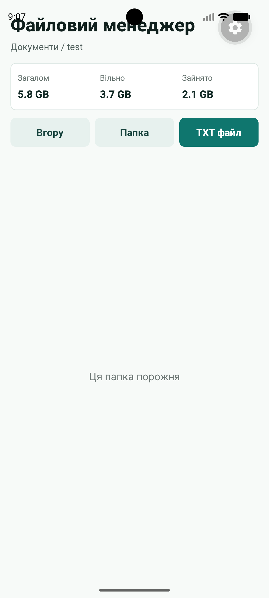
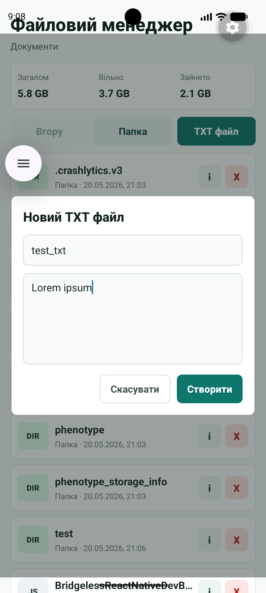
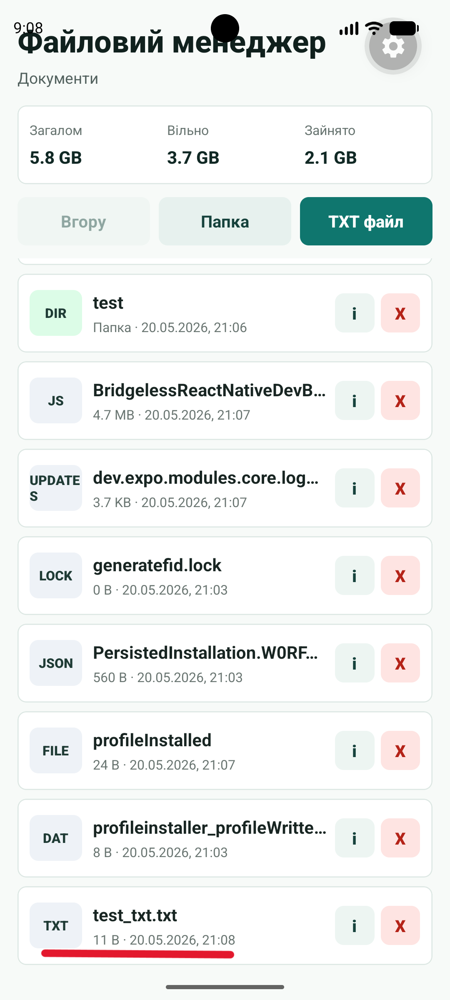
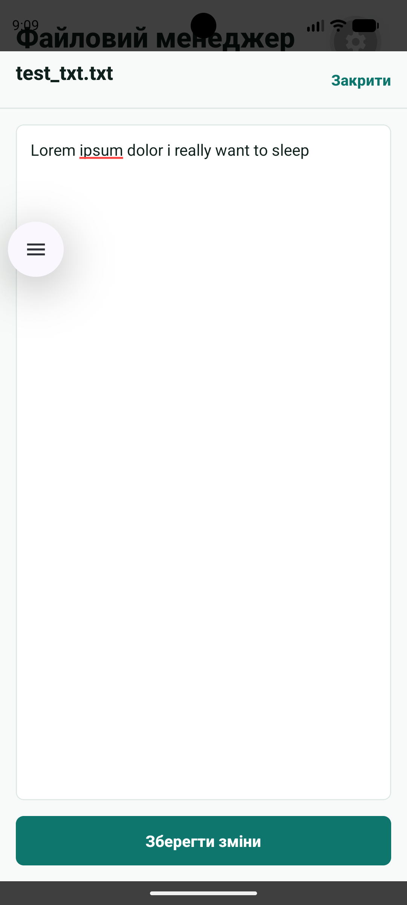
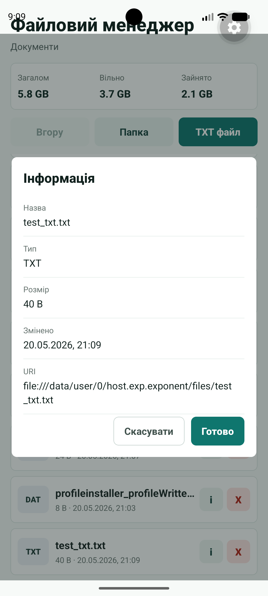

# Лабораторна робота №4

Мобільний застосунок **«Файловий менеджер»** для роботи з локальною файловою системою застосунку через `expo-file-system`.

## Запуск

1. Встановити залежності:

   ```bash
   npm install
   ```

2. Запустити Expo:

   ```bash
   npm start
   ```

3. Відкрити застосунок в Expo Go на Android/iOS або запустити на емуляторі:

   ```bash
   npm run android
   npm run ios
   ```

## Реалізований функціонал

- Відображення поточного шляху у форматі breadcrumb.
- Перегляд вмісту поточної директорії через `FlatList`.
- Перехід у вкладені папки та повернення на рівень вище.
- Створення нових папок.
- Створення `.txt` файлів із початковим текстом.
- Відкриття, перегляд і редагування текстових файлів.
- Збереження змін у відповідний файл.
- Видалення файлів і папок із підтвердженням.
- Перегляд детальної інформації: назва, тип, розмір, дата останньої модифікації та URI.
- Статистика пам'яті на головному екрані: загальний, вільний і зайнятий обсяг.

## Технічні деталі

У застосунку використано legacy API з `expo-file-system/legacy`, оскільки в актуальних версіях Expo асинхронні методи `readDirectoryAsync`, `writeAsStringAsync`, `readAsStringAsync`, `makeDirectoryAsync` і `deleteAsync` мають викликатися саме через legacy-імпорт.

Основні операції:

- `FileSystem.documentDirectory` - коренева директорія застосунку;
- `FileSystem.readDirectoryAsync` - читання списку файлів і папок;
- `FileSystem.getInfoAsync` - отримання атрибутів об'єкта;
- `FileSystem.makeDirectoryAsync` - створення папки;
- `FileSystem.writeAsStringAsync` - створення та редагування текстового файлу;
- `FileSystem.readAsStringAsync` - читання текстового файлу;
- `FileSystem.deleteAsync` - видалення файлу або папки;
- `FileSystem.getTotalDiskCapacityAsync` і `FileSystem.getFreeDiskStorageAsync` - статистика пам'яті.

## Скріншоти

### Головний екран зі статистикою пам'яті



### Створення папки

<p>
  
  
  
</p>

### Створення та редагування текстового файлу

<p>
  
  
  
</p>

### Перегляд інформації про файл


